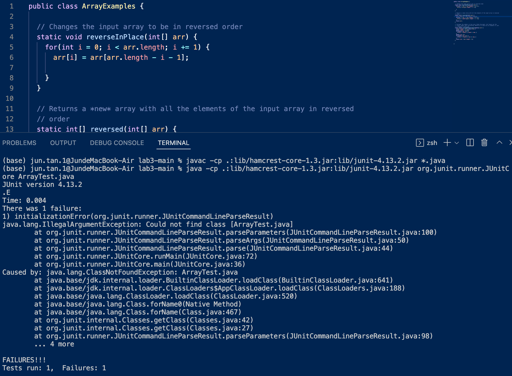

# Lab 5 Report - Jun T.
**Student:**

**What environment are you using (computer, operating system, web browser, terminal/editor, and so on)?**

Mac and VSCode Terminal

**Detail the symptom you're seeing. Be specific; include both what you're seeing and what you expected to see instead. Screenshots are great, copy-pasted terminal output is also great. Avoid saying “it doesn't work”.**

I opened the folder I downloaded from GitHub through VSCode and ran the javac and java command, but I'm seeing one failure and I don't know why. I would expect to see all test cases passed.

Terminal output: 
```
JUnit version 4.13.2
.E
Time: 0.004
There was 1 failure:
1) initializationError(org.junit.runner.JUnitCommandLineParseResult)
java.lang.IllegalArgumentException: Could not find class [ArrayTest.java]
        at org.junit.runner.JUnitCommandLineParseResult.parseParameters(JUnitCommandLineParseResult.java:100)
        at org.junit.runner.JUnitCommandLineParseResult.parseArgs(JUnitCommandLineParseResult.java:50)
        at org.junit.runner.JUnitCommandLineParseResult.parse(JUnitCommandLineParseResult.java:44)
        at org.junit.runner.JUnitCore.runMain(JUnitCore.java:72)
        at org.junit.runner.JUnitCore.main(JUnitCore.java:36)
Caused by: java.lang.ClassNotFoundException: ArrayTest.java
        at java.base/jdk.internal.loader.BuiltinClassLoader.loadClass(BuiltinClassLoader.java:641)
        at java.base/jdk.internal.loader.ClassLoaders$AppClassLoader.loadClass(ClassLoaders.java:188)
        at java.base/java.lang.ClassLoader.loadClass(ClassLoader.java:520)
        at java.base/java.lang.Class.forName0(Native Method)
        at java.base/java.lang.Class.forName(Class.java:467)
        at org.junit.internal.Classes.getClass(Classes.java:42)
        at org.junit.internal.Classes.getClass(Classes.java:27)
        at org.junit.runner.JUnitCommandLineParseResult.parseParameters(JUnitCommandLineParseResult.java:98)
        ... 4 more

FAILURES!!!
Tests run: 1,  Failures: 1
```

**Detail the failure-inducing input and context. That might mean any or all of the command you're running, a test case, command-line arguments, working directory, even the last few commands you ran. Do your best to provide as much context as you can.**

This is the screenshot of all the command I'm running:



**TA:**
Hello! I would suggest you trying `java -cp .:lib/hamcrest-core-1.3.jar:lib/junit-4.13.2.jar org.junit.runner.JUnitCore ArrayTests` instead of `java -cp .:lib/hamcrest-core-1.3.jar:lib/junit-4.13.2.jar org.junit.runner.JUnitCore ArrayTest.java`
