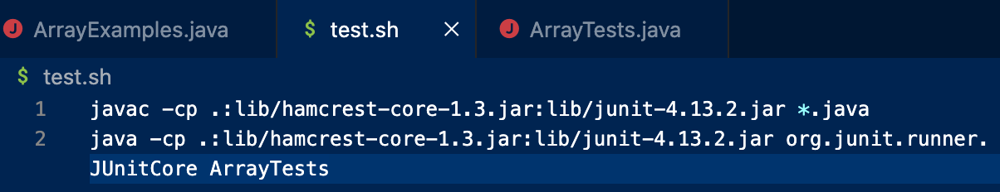
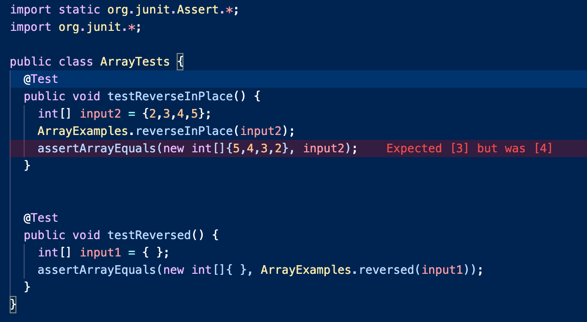
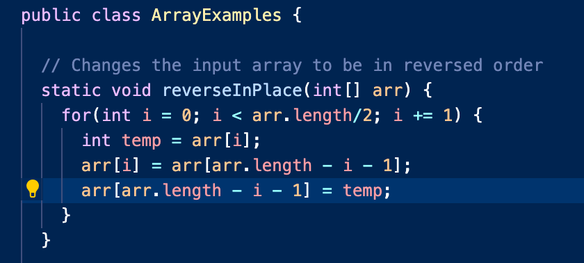
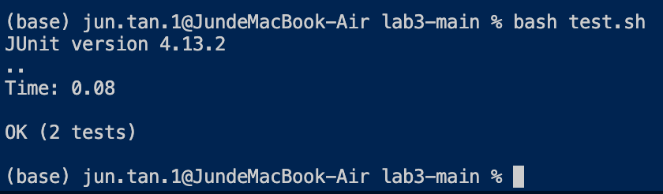

# Lab 5 Report - Jun T.
## Part 1
**Student:**

**What environment are you using (computer, operating system, web browser, terminal/editor, and so on)?**

Mac and VSCode Terminal

**Detail the symptom you're seeing. Be specific; include both what you're seeing and what you expected to see instead. Screenshots are great, copy-pasted terminal output is also great. Avoid saying “it doesn't work”.**

I opened the folder I downloaded from GitHub through VSCode, ran the javac and java command, and created a test.sh file to run bash, but I'm seeing one failure and I don't know why. I would expect to see all test cases passed.

Terminal output: 
```
JUnit version 4.13.2
.E.
Time: 0.024
There was 1 failure:
1) testReverseInPlace(ArrayTests)
arrays first differed at element [2]; expected:<3> but was:<4>
        at org.junit.internal.ComparisonCriteria.arrayEquals(ComparisonCriteria.java:78)
        at org.junit.internal.ComparisonCriteria.arrayEquals(ComparisonCriteria.java:28)
        at org.junit.Assert.internalArrayEquals(Assert.java:534)
        at org.junit.Assert.assertArrayEquals(Assert.java:418)
        at org.junit.Assert.assertArrayEquals(Assert.java:429)
        at ArrayTests.testReverseInPlace(ArrayTests.java:9)
        ... 32 trimmed
Caused by: java.lang.AssertionError: expected:<3> but was:<4>
        at org.junit.Assert.fail(Assert.java:89)
        at org.junit.Assert.failNotEquals(Assert.java:835)
        at org.junit.Assert.assertEquals(Assert.java:120)
        at org.junit.Assert.assertEquals(Assert.java:146)
        at org.junit.internal.ExactComparisonCriteria.assertElementsEqual(ExactComparisonCriteria.java:8)
        at org.junit.internal.ComparisonCriteria.arrayEquals(ComparisonCriteria.java:76)
        ... 38 more

FAILURES!!!
Tests run: 2,  Failures: 1
```


**Detail the failure-inducing input and context. That might mean any or all of the command you're running, a test case, command-line arguments, working directory, even the last few commands you ran. Do your best to provide as much context as you can.**

my code:


bash:


error message:


my test:



**TA:**
Hello! It seems like there are some indexing problems in your reverseinplace method. Here are some helpful hints that I have for you:
```
static void reverseInPlace(int[] arr) {
  //consider the condition here, would it be just arr.length?
  for(int i = 0; i < arr.length; i += 1) {
    //you may want to swap arr[i] with arr[arr.length - i - 1]
    arr[i] = arr[arr.length - i - 1];
  }
}
```
Other commands are correct. Good luck!

**Student:**
Thanks a lot for your response. I fixed my method and got the correct output!

code:


test:



## Part 2
I learned from week 7 that for any command, if the command run successfully, then $?(the exit code for whatever command you just run) would equals to 0.
